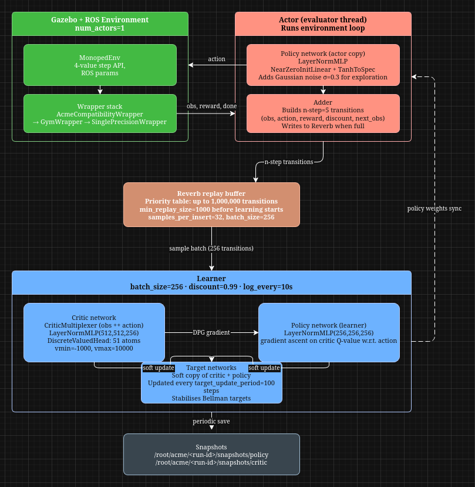

# Hoppip-v0
Distributed Distributional DDPG (D4PG) training for a one-legged hopper robot (Monoped-V0) in Gazebo/ROS, using Acme and Reverb, so that it jumps!

## Architecture


## Installation
1. Pull the monoped_rl docker environment
```bash
docker pull ntklab/monoped_rl:latest
```

2. In the terminal
```bash
xhost +local:root

docker run -it \
    --rm \
    --gpus all \
    --name monoped_rl \
	-p 6006:6006 \
    --privileged \
    --env=DISPLAY \
    --env=QT_X11_NO_MITSHM=1 \
    -v /tmp/.X11-unix:/tmp/.X11-unix \
    ntklab/monoped_rl \
    /bin/bash
```

3. Inside the docker environment
```bash
conda create -n d4pg python=3.10 -y
conda activate d4pg
```

4. Installing acme and other dependencies
```bash
git config --global url."https://github.com/".insteadOf "git://github.com/"
pip install dm-acme[tf]
pip uninstall tensorflow-datasets tensorflow-metadata
pip install rospkg pyyaml "protobuf<3.21" gym "numpy<2" dm_control
```

5. Install CUDA toolkit (to get access to GPU)
```bash
pip install nvidia-cuda-runtime-cu11==11.7.99 nvidia-cudnn-cu11==8.6.0.163 nvidia-cublas-cu11 nvidia-cufft-cu11 nvidia-curand-cu11 nvidia-cusolver-cu11 nvidia-cusparse-cu11
```

6. export CUDA toolkit path (you'll need to do this in each terminal session; to avoid you can export it to ~/.bashrc)
```bash
export LD_LIBRARY_PATH=$LD_LIBRARY_PATH:\
/root/miniconda3/envs/d4pg/lib/python3.10/site-packages/nvidia/cuda_runtime/lib:\
/root/miniconda3/envs/d4pg/lib/python3.10/site-packages/nvidia/cublas/lib:\
/root/miniconda3/envs/d4pg/lib/python3.10/site-packages/nvidia/cudnn/lib:\
/root/miniconda3/envs/d4pg/lib/python3.10/site-packages/nvidia/cufft/lib:\
/root/miniconda3/envs/d4pg/lib/python3.10/site-packages/nvidia/curand/lib:\
/root/miniconda3/envs/d4pg/lib/python3.10/site-packages/nvidia/cusolver/lib:\
/root/miniconda3/envs/d4pg/lib/python3.10/site-packages/nvidia/cusparse/lib
```

7. Check if GPU works
```bash
python3 -c "import tensorflow as tf; print('GPUs found:', tf.config.list_physical_devices('GPU'))"
```

8. This fixes the python shared library error (whatever that is)
```bash
export LD_LIBRARY_PATH=$CONDA_PREFIX/lib:$LD_LIBRARY_PATH
```

9. Start the simulation environment
```bash
source /opt/ros/noetic/setup.sh
cd /root/monoped_ws
source devel_isolated/setup.sh
roslaunch my_legged_robots_sims main.launch
```

10. To open the docker env in a new terminal
```bash
docker exec -it monoped_rl /bin/bash
```

11. Now, in a new terminal
```bash
source /opt/ros/noetic/setup.sh
cd /root/monoped_ws
source devel_isolated/setup.sh
roslaunch my_hopper_training d4pg.launch
```
